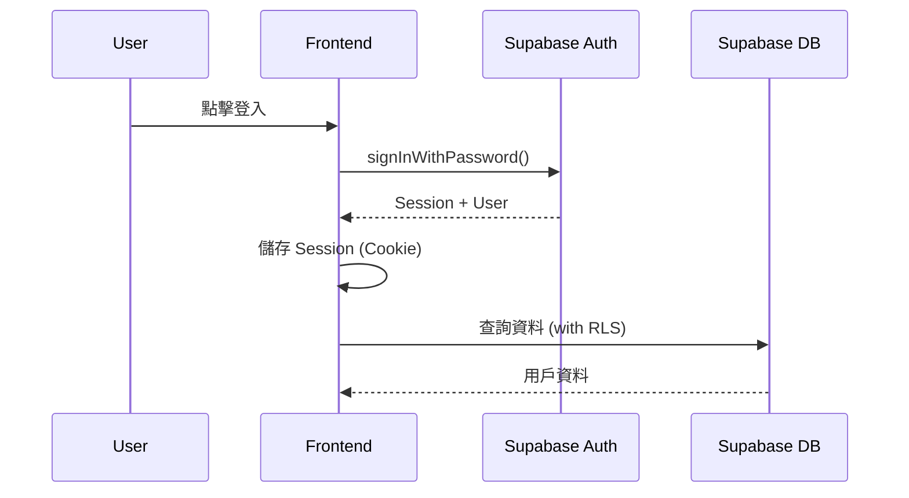
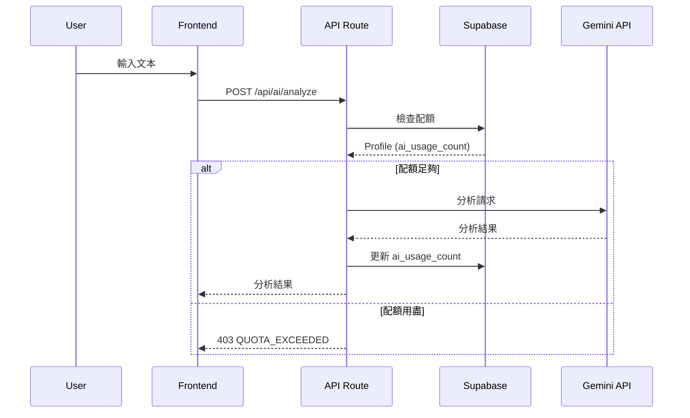
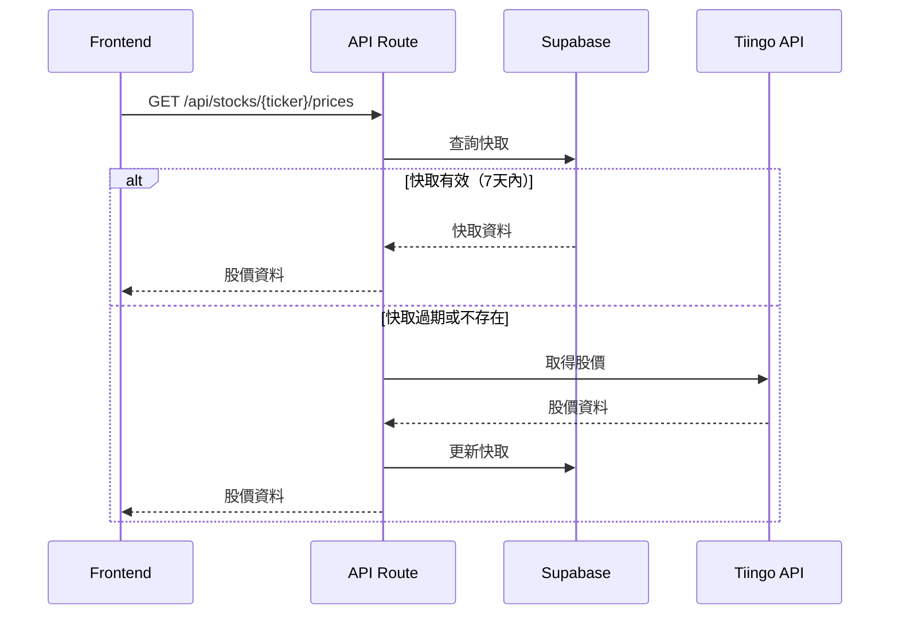

# Architecture Decision Records - Baburra.io

> **版本**: 1.0  
> **最後更新**: 2026-01-29  
> **狀態**: 規格定義（指導技術選型）

---

## 一、概述

本文件記錄 Baburra.io 應用的架構決策（ADR - Architecture Decision Records）。所有技術選型和架構決策都記錄於此，供開發 Agent 參考。

---

## 二、系統架構總覽

### 2.1 高層架構圖

```
┌─────────────────────────────────────────────────────────────────┐
│                         Client (Browser)                         │
├─────────────────────────────────────────────────────────────────┤
│                                                                 │
│  ┌─────────────────────────────────────────────────────────┐    │
│  │                    Next.js Application                   │    │
│  │  ┌─────────────┐  ┌─────────────┐  ┌─────────────┐      │    │
│  │  │  Marketing  │  │    Auth     │  │    App      │      │    │
│  │  │   (SSG)     │  │   Pages     │  │   Pages     │      │    │
│  │  └─────────────┘  └─────────────┘  └─────────────┘      │    │
│  │                                                         │    │
│  │  ┌─────────────────────────────────────────────────┐    │    │
│  │  │              Shared Components                   │    │    │
│  │  │   UI | Charts | Forms | Layout                   │    │    │
│  │  └─────────────────────────────────────────────────┘    │    │
│  │                                                         │    │
│  │  ┌─────────────────────────────────────────────────┐    │    │
│  │  │              State Management                    │    │    │
│  │  │   Zustand (Client) | TanStack Query (Server)     │    │    │
│  │  └─────────────────────────────────────────────────┘    │    │
│  └─────────────────────────────────────────────────────────┘    │
│                              │                                  │
└──────────────────────────────┼──────────────────────────────────┘
                               │
                               ▼
┌─────────────────────────────────────────────────────────────────┐
│                        Vercel Platform                          │
├─────────────────────────────────────────────────────────────────┤
│  ┌─────────────────┐  ┌─────────────────┐  ┌─────────────────┐  │
│  │  Static Assets  │  │   API Routes    │  │  Edge Runtime   │  │
│  │     (CDN)       │  │   (Serverless)  │  │   (Optional)    │  │
│  └─────────────────┘  └─────────────────┘  └─────────────────┘  │
└─────────────────────────────────────────────────────────────────┘
                               │
           ┌───────────────────┼───────────────────┐
           │                   │                   │
           ▼                   ▼                   ▼
┌─────────────────┐  ┌─────────────────┐  ┌─────────────────┐
│    Supabase     │  │   Gemini API    │  │   Tiingo API    │
│  ┌───────────┐  │  │                 │  │                 │
│  │   Auth    │  │  │  AI Text        │  │  Stock Prices   │
│  ├───────────┤  │  │  Analysis       │  │  (Daily OHLCV)  │
│  │PostgreSQL │  │  │                 │  │                 │
│  │   (DB)    │  │  └─────────────────┘  └─────────────────┘
│  ├───────────┤  │
│  │   RLS     │  │
│  └───────────┘  │
└─────────────────┘
```

### 2.2 目錄結構

```
stock-kol-tracker-web/
├── src/
│   ├── app/                      # Next.js App Router
│   │   ├── (marketing)/          # 公開頁面（SSG）
│   │   │   ├── page.tsx          # 落地頁
│   │   │   ├── features/
│   │   │   └── pricing/
│   │   ├── (auth)/               # 認證頁面
│   │   │   ├── login/
│   │   │   ├── register/
│   │   │   └── callback/
│   │   ├── (app)/                # 應用頁面（需登入）
│   │   │   ├── layout.tsx        # App Layout with Sidebar
│   │   │   ├── dashboard/
│   │   │   ├── input/
│   │   │   ├── kols/
│   │   │   │   ├── page.tsx      # KOL 列表
│   │   │   │   └── [id]/
│   │   │   │       └── page.tsx  # KOL 詳情
│   │   │   ├── stocks/
│   │   │   │   ├── page.tsx
│   │   │   │   └── [ticker]/
│   │   │   │       └── page.tsx
│   │   │   ├── posts/
│   │   │   │   ├── page.tsx
│   │   │   │   └── [id]/
│   │   │   │       └── page.tsx
│   │   │   └── settings/
│   │   └── api/                  # API Routes
│   │       ├── auth/
│   │       ├── ai/
│   │       │   ├── analyze/route.ts
│   │       │   └── usage/route.ts
│   │       ├── kols/
│   │       │   ├── route.ts
│   │       │   └── [id]/
│   │       │       ├── route.ts
│   │       │       └── win-rate/route.ts
│   │       ├── stocks/
│   │       │   ├── route.ts
│   │       │   └── [ticker]/
│   │       │       ├── route.ts
│   │       │       ├── prices/route.ts
│   │       │       └── win-rate/route.ts
│   │       ├── posts/
│   │       │   ├── route.ts
│   │       │   └── [id]/
│   │       │       ├── route.ts
│   │       │       └── publish/route.ts
│   │       └── webhooks/
│   │
│   ├── components/               # React 元件
│   │   ├── ui/                   # 基礎元件 (shadcn/ui)
│   │   │   ├── button.tsx
│   │   │   ├── card.tsx
│   │   │   ├── dialog.tsx
│   │   │   └── ...
│   │   ├── charts/               # 圖表元件
│   │   │   ├── candlestick-chart.tsx
│   │   │   └── sentiment-marker.tsx
│   │   ├── forms/                # 表單元件
│   │   │   ├── kol-form.tsx
│   │   │   ├── post-form.tsx
│   │   │   └── quick-input.tsx
│   │   └── layout/               # 佈局元件
│   │       ├── sidebar.tsx
│   │       ├── header.tsx
│   │       └── nav.tsx
│   │
│   ├── domain/                   # 領域層（核心業務邏輯）
│   │   ├── models/               # TypeScript 類型定義
│   │   │   ├── kol.ts
│   │   │   ├── stock.ts
│   │   │   ├── post.ts
│   │   │   └── index.ts
│   │   ├── services/             # 業務邏輯服務
│   │   │   ├── ai.service.ts
│   │   │   ├── kol.service.ts
│   │   │   ├── stock.service.ts
│   │   │   └── post.service.ts
│   │   ├── validators/           # 驗證規則
│   │   │   ├── post.validator.ts
│   │   │   ├── kol.validator.ts
│   │   │   └── invariants.ts
│   │   └── calculators/          # 計算邏輯
│   │       ├── price-change.calculator.ts
│   │       └── win-rate.calculator.ts
│   │
│   ├── infrastructure/           # 基礎設施層
│   │   ├── supabase/
│   │   │   ├── client.ts         # Browser Client
│   │   │   ├── server.ts         # Server Client
│   │   │   └── admin.ts          # Admin Client
│   │   ├── api/
│   │   │   ├── gemini.client.ts
│   │   │   └── tiingo.client.ts
│   │   └── repositories/
│   │       ├── kol.repository.ts
│   │       ├── stock.repository.ts
│   │       ├── post.repository.ts
│   │       └── stock-price.repository.ts
│   │
│   ├── hooks/                    # React Hooks
│   │   ├── use-auth.ts
│   │   ├── use-kols.ts
│   │   ├── use-stocks.ts
│   │   └── use-posts.ts
│   │
│   ├── stores/                   # Zustand Stores
│   │   ├── auth.store.ts
│   │   └── ui.store.ts
│   │
│   └── lib/                      # 工具函數
│       ├── utils/
│       │   ├── date.ts
│       │   ├── format.ts
│       │   └── cn.ts
│       └── constants/
│           ├── routes.ts
│           └── config.ts
│
├── supabase/                     # Supabase 專案設定
│   ├── migrations/               # 資料庫遷移
│   │   └── 001_initial_schema.sql
│   ├── functions/                # Edge Functions
│   │   └── scheduled-tasks/
│   └── seed.sql
│
├── docs/                         # 規格文件
│   ├── DOMAIN_MODELS.md
│   ├── API_SPEC.md
│   ├── INVARIANTS.md
│   └── ARCHITECTURE.md
│
├── public/                       # 靜態資源
├── .env.example
├── .env.local
├── next.config.js
├── tailwind.config.js
├── tsconfig.json
└── package.json
```

---

## 三、架構決策記錄 (ADR)

### ADR-001: 前端框架選擇 Next.js 14

**狀態**: 已決定  
**日期**: 2026-01-29

**背景**:
需要一個支援 SSG/SSR 混合渲染、SEO 友好、且有良好 React 生態支援的前端框架。

**決策**:
選擇 Next.js 14 (App Router)

**理由**:

1. App Router 提供更好的 Server Components 支援
2. 內建的 API Routes 可作為 BFF (Backend for Frontend)
3. 良好的 Vercel 整合
4. 支援 SSG（落地頁）和 CSR（應用頁面）混合
5. 活躍的社群和生態系統

**替代方案考慮**:

- Remix: 也是優秀選擇，但 Vercel 整合不如 Next.js
- Flutter Web: 可復用現有程式碼，但 SEO 和首屏載入較差

---

### ADR-002: 部署平台選擇 Vercel

**狀態**: 已決定  
**日期**: 2026-01-29

**背景**:
需要一個成本可控、易於部署、且與 Next.js 整合良好的平台。

**決策**:
選擇 Vercel

**理由**:

1. 與 Next.js 是同一公司產品，整合最佳
2. 免費額度足夠初期使用
3. 自動 CI/CD
4. 全球 CDN
5. Edge Functions 支援

**成本考量**:

- 免費方案：100GB 頻寬/月、100 GB-hrs Serverless
- 預估初期流量在免費額度內

---

### ADR-003: 資料庫選擇 Supabase (PostgreSQL)

**狀態**: 已決定  
**日期**: 2026-01-29

**背景**:
需要一個支援多用戶、成本可控、且有良好查詢能力的資料庫。

**決策**:
選擇 Supabase (PostgreSQL)

**理由**:

1. PostgreSQL 支援複雜查詢（勝率計算）
2. Row Level Security (RLS) 實現用戶資料隔離
3. 內建 Auth 服務
4. 成本可控（按儲存計費，而非按讀寫次數）
5. 開源，可自行部署

**替代方案考慮**:

- Firebase Firestore: 按讀寫計費，成本較難預測
- PlanetScale: 也是好選擇，但 Supabase 提供更多整合服務

---

### ADR-004: 認證方案選擇 Supabase Auth

**狀態**: 已決定  
**日期**: 2026-01-29

**背景**:
需要支援 Email/Password 和 OAuth 登入。

**決策**:
使用 Supabase Auth

**理由**:

1. 與 Supabase DB 整合，RLS 可直接使用 `auth.uid()`
2. 支援多種 OAuth Provider
3. 內建 Session 管理
4. 免費額度足夠（50,000 MAU）

---

### ADR-005: 狀態管理方案

**狀態**: 已決定  
**日期**: 2026-01-29

**背景**:
需要管理客戶端狀態和伺服器狀態。

**決策**:

- 伺服器狀態: TanStack Query (React Query)
- 客戶端狀態: Zustand

**理由**:

1. TanStack Query 提供優秀的快取、重新驗證、樂觀更新
2. Zustand 輕量、簡單、TypeScript 支援好
3. 兩者互補，分工明確

---

### ADR-006: K線圖套件選擇

**狀態**: 已決定  
**日期**: 2026-01-29

**背景**:
需要顯示股票 K 線圖並支援自定義標記。

**決策**:
選擇 Lightweight Charts (by TradingView)

**理由**:

1. 輕量（~45KB gzipped）
2. 免費開源
3. API 友好，支援自定義 Overlay
4. 效能好，支援大量資料

**替代方案考慮**:

- Apache ECharts: 功能更全但更重
- Highcharts: 商業授權

---

### ADR-007: 樣式方案選擇

**狀態**: 已決定  
**日期**: 2026-01-29

**背景**:
需要快速開發且保持 UI 一致性。

**決策**:
Tailwind CSS + shadcn/ui

**理由**:

1. Tailwind CSS 快速開發
2. shadcn/ui 提供高品質基礎元件
3. 可客製化程度高
4. 社群資源豐富

---

### ADR-008: 表單處理方案

**狀態**: 已決定  
**日期**: 2026-01-29

**決策**:
React Hook Form + Zod

**理由**:

1. React Hook Form 效能好，非受控元件
2. Zod 提供類型安全的 Schema 驗證
3. 兩者整合良好（@hookform/resolvers）

---

## 四、資料流程

### 4.1 認證流程



### 4.2 AI 分析流程



### 4.3 股價快取流程



---

## 五、部署架構

### 5.1 環境配置

| 環境        | 用途     | URL            |
| ----------- | -------- | -------------- |
| Development | 本地開發 | localhost:3000 |
| Preview     | PR 預覽  | \*.vercel.app  |
| Production  | 正式環境 | TBD            |

### 5.2 環境變數

```bash
# .env.example

# Supabase
NEXT_PUBLIC_SUPABASE_URL=
NEXT_PUBLIC_SUPABASE_ANON_KEY=
SUPABASE_SERVICE_ROLE_KEY=

# External APIs
GEMINI_API_KEY=
TIINGO_API_TOKEN=

# App
NEXT_PUBLIC_APP_URL=
```

### 5.3 CI/CD Pipeline

```yaml
# .github/workflows/ci.yml

name: CI

on:
  push:
    branches: [main]
  pull_request:
    branches: [main]

jobs:
  lint:
    runs-on: ubuntu-latest
    steps:
      - uses: actions/checkout@v4
      - uses: actions/setup-node@v4
      - run: npm ci
      - run: npm run lint

  test:
    runs-on: ubuntu-latest
    steps:
      - uses: actions/checkout@v4
      - uses: actions/setup-node@v4
      - run: npm ci
      - run: npm test

  # Vercel 自動部署（透過 Vercel GitHub Integration）
```

---

## 六、安全考量

### 6.1 認證與授權

- 使用 Supabase Auth 管理認證
- RLS 確保用戶資料隔離
- API Routes 驗證 Session

### 6.2 API 安全

- Rate Limiting 防止濫用
- API Key 儲存於環境變數
- CORS 限制允許的來源

### 6.3 資料保護

- 敏感資料不儲存於前端
- HTTPS only
- 定期備份資料庫

---

## 七、效能考量

### 7.1 前端效能

- 使用 Next.js Image Optimization
- 動態 import 實現 Code Splitting
- K 線圖使用虛擬滾動

### 7.2 API 效能

- 股價快取減少外部 API 調用
- 資料庫索引優化
- 分頁查詢避免大量資料

### 7.3 監控

- Vercel Analytics（流量）
- Supabase Dashboard（資料庫）
- Sentry（錯誤追蹤）

---

## 八、成本控制

### 8.1 免費額度使用策略

| 服務     | 策略               |
| -------- | ------------------ |
| Vercel   | 監控頻寬，超過警告 |
| Supabase | 監控儲存和連線數   |
| Gemini   | 用戶配額限制       |
| Tiingo   | 快取減少調用       |

### 8.2 升級觸發點

- Vercel：頻寬 > 80GB/月
- Supabase：儲存 > 400MB
- 用戶量：MAU > 1000

---

## 九、修改記錄

| 版本 | 日期       | 修改內容 |
| ---- | ---------- | -------- |
| 1.0  | 2026-01-29 | 初始版本 |
