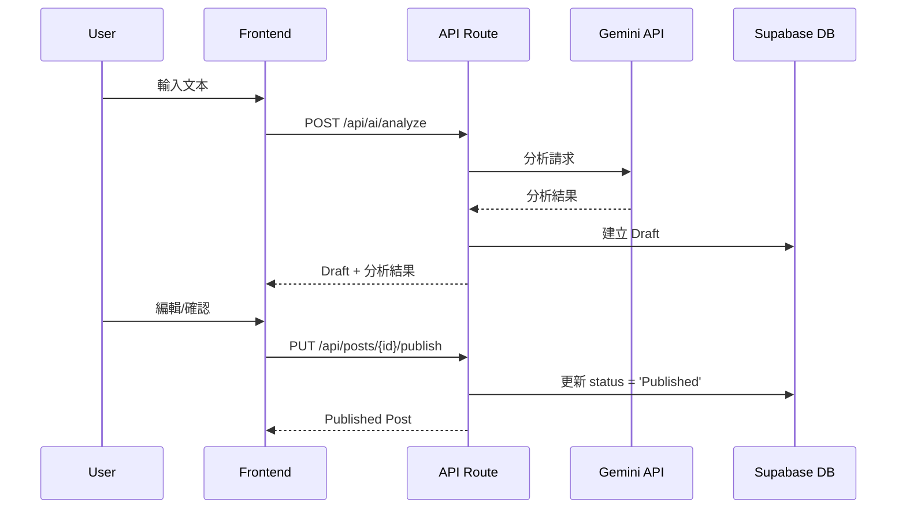
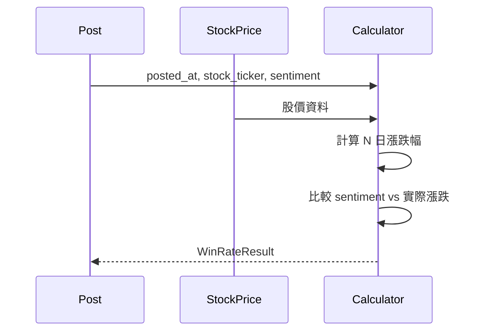

# Domain Models - Baburra.io

> **版本**: 1.0  
> **最後更新**: 2026-01-29  
> **狀態**: 規格定義（所有 Agent 必須遵守）

---

## 一、概述

本文件定義 Baburra.io 應用的領域模型，作為所有開發 Agent 的「唯一真理來源」。任何程式碼實作必須符合此處定義的模型結構。

---

## 二、實體關係圖

```mermaid
erDiagram
    User ||--o| Profile : has
    User ||--o{ KOL : owns
    User ||--o{ Stock : owns
    User ||--o{ Post : owns

    KOL ||--o{ Post : "authored_by"
    Stock ||--o{ Post : "mentions"
    Stock ||--o{ StockPrice : "has"

    User {
        uuid id PK
        string email
        timestamp created_at
    }

    Profile {
        uuid id PK_FK
        string display_name
        string plan
        int ai_usage_count
        timestamp created_at
    }

    KOL {
        uuid id PK
        uuid user_id FK
        string name
        string bio
        string social_link
        timestamp created_at
    }

    Stock {
        string ticker PK
        uuid user_id FK
        string name
        string exchange
        timestamp last_updated
    }

    Post {
        uuid id PK
        uuid user_id FK
        uuid kol_id FK
        string stock_ticker FK
        string content
        string sentiment
        timestamp posted_at
        timestamp created_at
        string status
        jsonb ai_analysis_json
    }

    StockPrice {
        serial id PK
        string ticker FK
        date date
        decimal open
        decimal close
        decimal high
        decimal low
        bigint volume
    }
```

---

## 三、實體定義

### 3.1 User（用戶）

由 Supabase Auth 自動管理，存於 `auth.users` 表。

| 欄位       | 類型      | 必填 | 說明                        |
| ---------- | --------- | ---- | --------------------------- |
| id         | UUID      | ✅   | 主鍵，由 Supabase Auth 生成 |
| email      | string    | ✅   | 用戶電子郵件                |
| created_at | timestamp | ✅   | 註冊時間                    |

**約束**：

- `email` 必須唯一
- 不可直接操作 `auth.users`，透過 Supabase Auth API

---

### 3.2 Profile（用戶資料）

用戶擴展資料，與 `auth.users` 一對一關聯。

| 欄位           | 類型      | 必填 | 預設值 | 說明                      |
| -------------- | --------- | ---- | ------ | ------------------------- |
| id             | UUID      | ✅   | -      | 主鍵，FK → auth.users     |
| display_name   | string    | ❌   | null   | 顯示名稱                  |
| plan           | string    | ✅   | 'free' | 方案類型：'free' \| 'pro' |
| ai_usage_count | int       | ✅   | 0      | 當月 AI 分析次數          |
| created_at     | timestamp | ✅   | NOW()  | 建立時間                  |

**約束**：

- `plan` 只能是 `'free'` 或 `'pro'`
- `ai_usage_count` 每月 1 日重置為 0

**TypeScript 類型**：

```typescript
interface Profile {
  id: string;
  display_name: string | null;
  plan: 'free' | 'pro';
  ai_usage_count: number;
  created_at: string;
}
```

---

### 3.3 KOL（網紅/意見領袖）

用戶追蹤的 KOL 資料。

| 欄位        | 類型      | 必填 | 預設值            | 說明            |
| ----------- | --------- | ---- | ----------------- | --------------- |
| id          | UUID      | ✅   | gen_random_uuid() | 主鍵            |
| user_id     | UUID      | ✅   | -                 | FK → auth.users |
| name        | string    | ✅   | -                 | KOL 名稱        |
| bio         | string    | ❌   | null              | 簡介            |
| social_link | string    | ❌   | null              | 社群連結        |
| created_at  | timestamp | ✅   | NOW()             | 建立時間        |

**約束**：

- `UNIQUE(user_id, name)`：同一用戶的 KOL 名稱不可重複
- 免費用戶最多建立 5 個 KOL

**TypeScript 類型**：

```typescript
interface KOL {
  id: string;
  user_id: string;
  name: string;
  bio: string | null;
  social_link: string | null;
  created_at: string;
}

// 建立 KOL 的輸入
interface CreateKOLInput {
  name: string;
  bio?: string;
  social_link?: string;
}

// 更新 KOL 的輸入
interface UpdateKOLInput {
  name?: string;
  bio?: string;
  social_link?: string;
}
```

---

### 3.4 Stock（投資標的）

用戶追蹤的股票。

| 欄位         | 類型      | 必填 | 預設值 | 說明                      |
| ------------ | --------- | ---- | ------ | ------------------------- |
| ticker       | string    | ✅   | -      | 主鍵，股票代碼（如 AAPL） |
| user_id      | UUID      | ✅   | -      | FK → auth.users           |
| name         | string    | ❌   | null   | 公司名稱                  |
| exchange     | string    | ❌   | null   | 交易所（如 NASDAQ）       |
| last_updated | timestamp | ✅   | NOW()  | 最後更新時間              |

**約束**：

- `ticker` 為主鍵，格式為大寫英文（如 AAPL、TSLA）
- `ticker` 長度 1-10 字元

**TypeScript 類型**：

```typescript
interface Stock {
  ticker: string;
  user_id: string;
  name: string | null;
  exchange: string | null;
  last_updated: string;
}

// 建立/更新 Stock 的輸入
interface UpsertStockInput {
  ticker: string;
  name?: string;
  exchange?: string;
}
```

---

### 3.5 Post（文檔/發言記錄）

KOL 發言的記錄，核心業務實體。

| 欄位             | 類型      | 必填 | 預設值            | 說明                                      |
| ---------------- | --------- | ---- | ----------------- | ----------------------------------------- |
| id               | UUID      | ✅   | gen_random_uuid() | 主鍵                                      |
| user_id          | UUID      | ✅   | -                 | FK → auth.users                           |
| kol_id           | UUID      | ❌   | null              | FK → kols                                 |
| stock_ticker     | string    | ❌   | null              | FK → stocks                               |
| content          | string    | ✅   | -                 | 原始文本內容                              |
| sentiment        | integer   | ❌   | null              | 情緒：-3(強烈看空) ~ +3(強烈看多)，7 級制 |
| posted_at        | timestamp | ❌   | null              | KOL 發文時間                              |
| created_at       | timestamp | ✅   | NOW()             | 建檔時間                                  |
| status           | string    | ✅   | 'Draft'           | 狀態：'Draft' \| 'Published'              |
| ai_analysis_json | JSONB     | ❌   | null              | AI 分析結果                               |

**約束**：

- `sentiment` 為整數，範圍 -3 ~ +3（-3: 強烈看空, -2: 看空, -1: 略微看空, 0: 中立, +1: 略微看多, +2: 看多, +3: 強烈看多）或 `null`
- `status` 只能是 `'Draft'` 或 `'Published'`
- `Published` 狀態的 Post 必須有 `kol_id` 和 `stock_ticker`
- `posted_at` 不能晚於 `created_at`
- `status` 從 `Draft` 變為 `Published` 後不可逆

**TypeScript 類型**：

```typescript
// 7-point sentiment scale: -3 (強烈看空) to +3 (強烈看多)
type Sentiment = -3 | -2 | -1 | 0 | 1 | 2 | 3;
type PostStatus = 'Draft' | 'Published';

interface AIAnalysisResult {
  sentiment: Sentiment;
  tickers: string[];
  kolName: string | null;
  postedAtText: string | null;
  summary: string[];
  redundantText: string | null;
}

interface Post {
  id: string;
  user_id: string;
  kol_id: string | null;
  stock_ticker: string | null;
  content: string;
  sentiment: Sentiment | null;
  posted_at: string | null;
  created_at: string;
  status: PostStatus;
  ai_analysis_json: AIAnalysisResult | null;
}

// 建立草稿的輸入
interface CreateDraftInput {
  content: string;
}

// 更新草稿的輸入
interface UpdateDraftInput {
  content?: string;
  kol_id?: string;
  stock_ticker?: string;
  sentiment?: Sentiment;
  posted_at?: string;
  ai_analysis_json?: AIAnalysisResult;
}

// 發布 Post 的輸入
interface PublishPostInput {
  kol_id: string; // 必填
  stock_ticker: string; // 必填
  sentiment: Sentiment; // 必填
  posted_at: string; // 必填
}
```

---

### 3.6 StockPrice（股價快取）

股價歷史資料，全域共享（不分用戶）。

| 欄位   | 類型    | 必填 | 預設值 | 說明             |
| ------ | ------- | ---- | ------ | ---------------- |
| id     | SERIAL  | ✅   | auto   | 主鍵             |
| ticker | string  | ✅   | -      | 股票代碼         |
| date   | DATE    | ✅   | -      | 股價日期         |
| open   | decimal | ❌   | null   | 開盤價           |
| close  | decimal | ❌   | null   | 收盤價（調整後） |
| high   | decimal | ❌   | null   | 最高價           |
| low    | decimal | ❌   | null   | 最低價           |
| volume | bigint  | ❌   | null   | 交易量           |

**約束**：

- `UNIQUE(ticker, date)`：同一股票同一日期唯一
- 不設 `user_id`，所有用戶共享
- 快取有效期：7 天

**TypeScript 類型**：

```typescript
interface StockPrice {
  id: number;
  ticker: string;
  date: string; // YYYY-MM-DD
  open: number | null;
  close: number | null;
  high: number | null;
  low: number | null;
  volume: number | null;
}

// K線圖資料格式
interface CandlestickData {
  time: string; // YYYY-MM-DD
  open: number;
  high: number;
  low: number;
  close: number;
  volume?: number;
}
```

---

## 四、聚合與查詢模型

### 4.1 PostWithDetails（文檔詳情）

包含關聯的 KOL 和 Stock 資訊。

```typescript
interface PostWithDetails extends Post {
  kol: KOL | null;
  stock: Stock | null;
}
```

### 4.2 KOLWithStats（KOL 統計）

包含勝率統計資訊。

```typescript
interface KOLWithStats extends KOL {
  post_count: number;
  win_rate_5d: number | null;
  win_rate_30d: number | null;
  win_rate_90d: number | null;
  win_rate_365d: number | null;
}
```

### 4.3 StockWithStats（Stock 統計）

包含文檔統計資訊。

```typescript
interface StockWithStats extends Stock {
  post_count: number;
  bullish_count: number;
  bearish_count: number;
  neutral_count: number;
}
```

### 4.4 PriceChangeResult（漲跌幅結果）

```typescript
interface PriceChangeResult {
  days: number;
  startDate: string;
  endDate: string;
  startPrice: number;
  endPrice: number;
  change: number; // 絕對變化
  changePercent: number; // 百分比變化 (0.05 = 5%)
}
```

### 4.5 WinRateStats（勝率統計）

```typescript
interface WinRateStats {
  period: number; // 5, 30, 90, 365
  totalPredictions: number;
  correctPredictions: number;
  winRate: number; // 0-1
  excluded: number; // 震盪區間排除數
}
```

#### Units contract for WinRateSample

Persisted `post_win_rate_samples` rows use mixed number spaces by design:

| Field            | Space                        | Example                |
| ---------------- | ---------------------------- | ---------------------- |
| `price_change`   | **percent-space**            | `2.8` means a +2.8% move |
| `threshold_value`| **fraction-space**           | `0.046` means 4.6% σ     |
| `excess_return`  | σ-multiples (dimensionless)  | `1.74` means +1.74σ      |

The pure classifier (`classifyOutcome`, `computeExcessReturn`) assumes **both**
`priceChange` and `threshold` are in fraction-space, so the service layer
(`computeWinRateStats`) normalizes `priceChange / 100` before calling the
classifier. The raw `price_change` is persisted in percent-space because
`computeReturn` / `avgReturn` consume it directly for percentage display.

Source of truth:
[`openspec/changes/fix-win-rate-units-mismatch/specs/win-rate-classification/spec.md`](../openspec/changes/fix-win-rate-units-mismatch/specs/win-rate-classification/spec.md).
Queries that read these rows MUST pin `classifier_version = CLASSIFIER_VERSION`
— legacy `v1` rows carry 100×-inflated `excess_return` from the pre-fix
units mismatch.

---

## 五、資料流程圖

### 5.1 建檔流程



### 5.2 勝率計算流程



---

## 六、修改記錄

| 版本 | 日期       | 修改內容 |
| ---- | ---------- | -------- |
| 1.0  | 2026-01-29 | 初始版本 |
